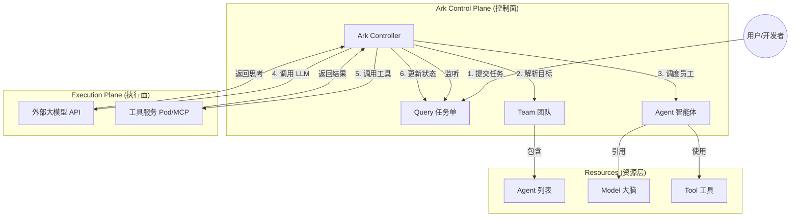

# Ark 架构原理与使用指南

本文档旨在深入剖析 Ark ("Agent as a Resource") 的设计理念、核心架构以及从零开始的使用流程。

## 1. 核心理念：Agent Native on Kubernetes

Ark 的核心思想是将 **AI Agent（智能体）** 提升为 **Kubernetes 一等公民**。
在此之前，K8s 只懂 Pod、Service、Ingress；而在 Ark 之后，K8s 开始“懂” Agent、Team 和 Model。

这意味着你可以用管理微服务的方式来管理 AI 团队：

- **声明式 API (YAML)**：用代码定义你的 AI 员工和团队结构。
- **GitOps**：版本化管理你的 AI 劳动力。
- **自动编排**：由 Controller 负责生命周期管理、状态流转和错误恢复。

## 2. 架构原理

Ark 采用标准的 **Kubernetes Operator 模式**。它引入了一组 Custom Resource Definitions (CRDs) 和一个 Controller Manager。

### 架构图解



### 核心组件详解

| 资源 (Kind) | 角色隐喻        | 职责描述                                                             | 关键字段                                                                            |
| :---------- | :-------------- | :------------------------------------------------------------------- | :---------------------------------------------------------------------------------- |
| **Query**   | **工单/任务书** | 整个流程的触发器。用户的输入（Prompt）和最终结果都存在这里。         | `spec.input`: 你的问题<br>`status.response`: AI 的回答                              |
| **Team**    | **项目组**      | 定义协作模式。是轮流发言 (Round Robin) 还是线性接力 (Sequential)？   | `spec.members`: 包含哪些 Agent<br>`spec.strategy`:协作策略                          |
| **Agent**   | **员工**        | 定义人设和能力。它是一个“配置”，本身不运行代码，由 Controller 驱动。 | `spec.prompt`: 角色设定<br>`spec.tools`: 可用工具列表<br>`spec.model`: 使用哪个模型 |
| **Model**   | **大脑**        | 统一纳管 LLM 凭证。与 Agent 解耦，方便统一切换模型或轮换 Key。       | `spec.provider`: openai/azure等<br>`spec.config`: API Key 和 URL                    |
| **Tool**    | **技能**        | 外部能力的注册表。可以是 HTTP 接口，也可以是 MCP 服务。              | `spec.http`: 接口地址<br>`spec.mcp`: MCP 服务坐标                                   |

## 3. 深度解析：为什么 Agent 不直接调用大模型？

你可能会问："为什么 Agent YAML 里不直接写 API Key？为什么要多一个 `Model` 资源？"

这其实是 Ark 架构中最精髓的 **"解耦设计" (Decoupling)**。

想象一下如果你有 50 个员工 (Agent)：

- **如果不解耦**：你得在 50 个 YAML 里分别填上 `sk-xxx`。要是 Key 过期了，你得改 50 次文件。
- **如果解耦 (Ark 的做法)**：
  - 你创建一个 `Model` 资源（比如叫 `company-gpt4`），里面填一次 Key。
  - 所有 50 个 Agent 只需写一行 `modelRef: company-gpt4`。
  - **好处 1（运维便利）**：Key 轮换时，只改 `Model` 一个文件，全公司员工自动生效。
  - **好处 2（成本控制）**：你可以把 Research Team 指向 `gpt-4` (昂贵)，把 Coding Team 指向 `deepseek-v3` (便宜)。只需改一下引用，不用动代码。
  - **好处 3（安全性）**：Agent 定义文件可以公开提交到 Git，因为它不包含敏感 Key；Key 被隔离在 `Model` 资源（或 K8s Secret）中。

**总结**：`Model` 是「公司配备的电脑」，`Agent` 是「员工」。员工入职时，公司发一台配好环境的电脑给他用，而不是让他自己带。

## 4. 工作流机制 (The Loop)

当你执行 `kubectl apply -f query.yaml` 时，后台发生了什么？

1.  **Reconcile (调和)**: Ark Controller 发现有一个新的 Query，状态是 `Pending`。
2.  **Initialization (组队)**: Controller 根据 Query 指定的 Target（比如 Team），拉取所有相关的 Agent、Model 和 Tool 配置。
3.  **Execution Loop (执行循环)**:
    - **Step 1**: Controller 选取 Team 中的第一个 Agent（例如 Researcher）。
    - **Step 2 (Think)**: Controller 组装 Prompt（包含 System Prompt + 用户 Query），发送给 **Model**。
    - **Step 3 (Act)**: 如果 Model 决定调用工具，Controller 拦截请求，去调用 K8s 集群内的 **Tool** 服务。
    - **Step 4 (Observe)**: 工具结果返回给 Controller，Controller 再追加到对话历史中，再次喂给 Model。
    - **Step 5 (Handover)**: 任务完成后，Controller 根据 Team 策略，将上下文传递给下一个 Agent（例如 Analyst）。
4.  **Completion (完结)**: 所有步骤完成后，Controller 将最终结论写入 Query 的 `Status`。

## 4. 最佳实践流程

如果你要“铲了重来”，或者在生产环境使用，建议遵循以下标准流程：

### 第一阶段：基础设施铺设 (Ops)

1.  **安装 Ark**: 使用 Helm 部署 Controller 和 CRD。
2.  **配置模型 (Model)**: 创建 `Model` 资源，填入 API Key (OpenAI/Qwen/Azure)。这是所有 Agent 的动力源。
3.  **部署工具 (Tools)**: 部署常用的工具服务（如搜索、文件读写、数据库操作），并创建对应的 `Tool` 资源注册它们。

### 第二阶段：团队组建 (Dev)

1.  **定义员工 (Agents)**: 编写 YAML 定义你的数字员工。给 Researcher 配上搜索工具，给 Coder 配上文件读写工具。
2.  **组建团队 (Teams)**: 编写 YAML 把员工组合起来，定义工作流。

### 第三阶段：任务发布 (User)

1.  **提交任务 (Query)**: 编写简单的 YAML 提交任务。
2.  **验收成果**: 查看 Query 状态获取结果。

## 5. 核心观念转变：代码 vs 配置

你之前的疑问 "Agent 代码里做了代理吗？" 触及了 Ark 与传统 AI 开发最大的不同。

### 传统开发 (Python/LangChain)

你需要**写代码**来创建一个 Agent：

```python
# 你的 Agent 代码
my_llm = new OpenAI(apiKey="sk-xxx") // 1. 实例化 LLM
agent = new Agent(prompt="...", llm=my_llm) // 2. 绑定
agent.run() // 3. 运行
```

在这里，你的代码就是引擎。

### Ark 开发 (Kubernetes Operator)

你**不写 Agent 代码**，你只写**配置文件 (YAML)**。
Ark Controller 是那个**已经写好的、唯一的超级引擎**。

```yaml
# 你的 YAML (只是数据，不是代码)
kind: Agent
spec:
  modelRef: default # 指向另一份数据
```

当 Controller 运行时，它内部的 Go 代码逻辑大概是这样的（伪代码）：

```go
// Ark Controller 的内部逻辑
func Reconcile(agentConfig) {
    // 1. Controller 帮你会读取 YAML 里的 modelRef
    modelConfig := k8s.Get("Model", agentConfig.modelRef)

    // 2. Controller 帮你 new 了一个 LLM 对象！
    // (这本来是你以前要自己写在代码里的)
    llmClient := NewOpenAIClient(modelConfig.ApiKey)

    // 3. Controller 使用这个 client 发请求
    response := llmClient.Chat(agentConfig.Prompt)
}
```

**结论**：

- **Agent 只是配方**（静态数据）。
- **Controller 才是厨师**（动态程序）。
- 厨师读了配方，发现要用“特级酱油(Model)”，于是厨师去架子上拿来酱油，倒进锅里。配方单子上并没有粘着酱油瓶。

## 6. 核心逻辑：Controller 如何选择下一个 Agent？ (Team Strategy)

你问到："给了 Controller 一堆 Agent，它怎么知道选谁？"
你非常敏锐地指出了 **"Workflow Automation" (工作流自动化)** 与 **"Autonomous Agents" (自主智能体)** 的区别。

目前 Ark (v1alpha1) 提供了两种基础模式：

### 模式 A：顺序接力 (Sequential) - 强流程 (Workflow)

这是我们在 `walkthrough` 里看到的模式。

- **逻辑**：写死顺序 (1->2->3)。
- **优点**：确定性高，适合 SOP (标准作业程序) 明确的场景（如：搜索->总结->写周报）。
- **缺点**：不灵活。

### 模式 B：动态路由 (Router/Round Robin) - 强智能 (MAS)

如果你想要 Agent 自己判断 "该找谁"，Ark 支持通过 **Selector Strategy** 来实现（正如我们在 `samples/dynamic-routing/` 中演示的那样）：

1.  **定义一个 Router Agent (组长)**：
    - Prompt: "你是组长... 如果需要计算找 MathExpert，如果需要写诗找 Poet。"
2.  **定义 Team 为 Selector 模式**：
    - 指定 `spec.strategy: selector`，并指定 `selector.agent: router`。
    - Controller 会在每一轮都先询问 Router Agent：“下一棒该谁跑？”。

#### 实战演练 (Demo)

我们成功运行了一个 `dynamic-routing-query`，任务是：

1.  先算数 (50 \* 2)
2.  再写诗 (Haiku)
3.  最后讲历史 (发生在公元 100 年)

**运行结果证明**：
Router Agent 精准地执行了调度：

1.  **Turn 1**: 调度给 `math-expert` (算出 100)
    : **Turn 2**: 调度给 `poet` (写了首关于 100 的俳句)
2.  **Turn 3**: 调度给 `historian` (讲了 Trajan 皇帝 Story)

这就是真正的 **MAS (Multi-Agent System)**：根据任务内容动态决定调用链，而不是死板的顺序。

**真正的 MAS** 确实应该是动态的。
但在实际工程落地中，**80% 的企业场景其实需要的是稳定的 Sequential Workflow**（因为老板需要结果可预测），只有 20% 的探索性场景需要完全自主的动态路由。

Ark 的设计初衷是**先满足确定性业务**，同时保留动态扩展的能力。

## 7. 调试与观测

由于一切都是 K8s 资源，你可以使用原生命令调试：

- **看状态**: `kubectl get queries` / `kubectl get agents`
- **看详情**: `kubectl describe query <name>` (最有用，不仅能看到结果，还能看到 Events 流水账)
- **看现场**: `kubectl logs -n ark-system deployment/ark-controller-manager` (查看 Controller 与 LLM 交互的原始日志)

---

_Generated by Antigravity for mas-ark verification_
